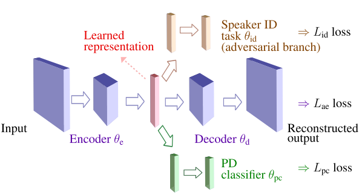

# Supervised Speech Representation Learning for Parkinson's Disease Classification with Voice Augmentations



## Introduction

This repository contains the code for our research on **Supervised Speech Representation Learning for Parkinson's Disease Classification**, with additional implementations for **voice augmentation strategies specifically applied to vowel-based PD detection**.

### Original Framework
The base framework implements the supervised speech representation learning approach from:
```
@INPROCEEDINGS{Janbakhshi2021ITG,
author={Janbakhshi, Parvaneh and Kodrasi, Ina},
booktitle={ITG Conference on Speech Communication},
Note = {accepted},
title={Supervised Speech Representation Learning for Parkinson's Disease Classification},
Month = {July},
year={2021},
pages={arXiv:2106.00531}}
```

### New Contributions
This repository extends the original work with:
- **Voice-specific data augmentation** for Parkinson's Disease detection
- **Vowel-focused analysis pipeline** for the PC-GITA dataset
- **Automated experimental workflows** for cross-validation studies
- **Comprehensive results analysis tools**

## What's Included

### Core Framework
* Supervised representation learning for Parkinson's disease (PD) classification using an auto-encoder and auxiliary tasks:
    * Adversarial speaker identity-invariant training
    * PD discriminative training
* Speech representation computation with both online and offline preprocessing
* Training pipeline for upstream tasks (auto-encoder with auxiliary tasks)
* Downstream task training/testing (PD classification using pre-trained representations)

### New Voice Augmentation Components
* **Three voice-specific augmentation techniques**:
    * **Time Shifting**: Circular time-domain shifts of audio signals
    * **Band-Pass Filtering**: Frequency filtering (500-1500 Hz) to focus on critical speech bands
    * **Colored Noise Addition**: Addition of 1/f^β noise with controlled SNR (15-30 dB)
* **Vowel-specific preprocessing pipeline** for PC-GITA dataset
* **Automated cross-validation workflows** for systematic evaluation
* **Performance analysis and visualization tools**

## Requirements
Python 3.7 or above  
PyTorch 1.6.0 or above  

Additional required packages:
- cudatoolkit
- joblib
- pandas
- torchaudio
- yaml
- soundfile
- tqdm
- scikit-learn
- numpy
- matplotlib (for results visualization)

To create a conda environment with dependencies:
```bash
conda env create -f req.yml
```

## Dataset

### PC-GITA Database
We tested the method on the Spanish PC-GITA database using cross-fold validation paradigm. The PC-GITA corpus contains:
- 50 Parkinson's Disease patients
- 50 healthy control subjects
- Various speech tasks including sustained vowels (/a/, /e/, /i/, /o/, /u/)
- Recordings at 44.1 kHz, 16-bit resolution

### Demo Database
For feature extraction demonstration, we include a **dummy database** from wav samples of "Boston University Radio Corpus Data (female speaker)":
- `https://catalog.ldc.upenn.edu/LDC96S36`
- `http://www.fit.vutbr.cz/~motlicek/speech_hnm.html`

## Usage

### 1. Data Preprocessing

#### Original Data (Baseline)
For preprocessing the PC-GITA vowel data without augmentation:
```bash
python preprocess/PC-GITA_baseline_vowels/preprocess_pcgita_vowels.py \
    --Database path/to/pcgita/vowels \
    --metadata_file path/to/metadata.csv \
    --output_dir preprocess/PCGITA_vowels_baseline \
    --njobs 4
```

#### Augmented Data Pipeline
First, generate augmented audio files:
```bash
python generate_augmented_audio.py \
    --input_base_dir path/to/pcgita/vowels \
    --output_base_dir preprocess/PCGITA_vowels_augmented/augmented_audio \
    --metadata_file path/to/metadata.csv \
    --augmentations time_shift band_pass colored_noise \
    --njobs 4
```

Then preprocess the augmented data:
```bash
python preprocess/pc_gita_vowels_augmented/preprocess_pcgita_vowels_augmented.py \
    --augmented_base_dir preprocess/PCGITA_vowels_augmented/augmented_audio \
    --metadata_file path/to/metadata.csv \
    --output_dir preprocess/PCGITA_vowels_augmented \
    --njobs 4
```

#### Demo Database Preprocessing
```bash
python preprocess/dummy_database/preprocess.py
```

### 2. Upstream Training with Auxiliary Tasks

The framework supports three auto-encoder architectures:
- `AECNNNet`: CNN auto-encoder (recommended, as used in paper)
- `AEMLPNet`: MLP auto-encoder  
- `AERNNNet`: RNN auto-encoder

#### Training with Auxiliary Tasks (Fusion Model)
```bash
python train_upstream.py \
    --newinit \
    --valmonitor \
    --auxiltr \
    --auxlossw1 -0.01 \
    --auxlossw2 0.01 \
    --fold 1
```

Parameters:
- `--auxlossw1 -0.01`: Adversarial speaker ID loss weight (negative for adversarial training)
- `--auxlossw2 0.01`: PD discriminative loss weight
- Set either weight to 0 to disable that auxiliary task

#### Training without Auxiliary Tasks
```bash
python train_upstream.py --newinit --valmonitor --fold 1
```

### 3. Downstream Training and Evaluation

#### Training the PD Classifier
```bash
python train_downstream.py \
    --valmonitor \
    --newinit \
    --mode train \
    --fold 1
```

#### Evaluation
```bash
python train_downstream.py \
    --mode evaluation \
    --fold 1
```

#### Fine-tuning Option
Add `--upstream_trainable` to fine-tune the upstream encoder during downstream training.

### 4. Automated Cross-Validation

For systematic evaluation across all 10 folds:
```bash
chmod +x run_all_folds.sh
./run_all_folds.sh
```

This script automatically:
- Trains upstream models for all folds
- Trains downstream classifiers for all folds
- Supports both baseline and augmented data configurations

### 5. Results Analysis

Extract and analyze results across all folds:
```bash
python results.py
```

This script provides:
- Performance metrics (accuracy, AUC) per fold
- Mean and standard deviation across folds
- Comparison between baseline and augmented conditions
- Statistical analysis and visualization

## Experimental Configurations

### Voice Augmentation Parameters
- **Time Shift**: Random circular shift within audio duration
- **Band-Pass Filter**: Butterworth filter, 500-1500 Hz passband
- **Colored Noise**: 1/f^β noise with β ∈ [4,6], SNR ∈ [15,30] dB

### Model Architecture (Fusion Configuration)
- **Encoder**: 4 CNN layers (16→32→64→128 feature maps) + FC layer (256→128)
- **Decoder**: Transposed convolutions mirroring encoder
- **Auxiliary Task 1**: Speaker ID classifier (adversarial, 2 FC layers)
- **Auxiliary Task 2**: PD classifier (discriminative, 2 FC layers)
- **Loss Function**: (1-α-λ)L_ae + αL_pc - λL_id

### Cross-Validation Setup
- 10-fold speaker-independent cross-validation
- Stratified splitting ensuring balanced PD/HC distribution
- No speaker overlap between train/validation/test sets

## Key Results

### Vowel-Based PD Detection Performance
| Condition | Accuracy (%) | AUC |
|-----------|-------------|-----|
| Baseline (Original Vowels) | 54.00 ± 11.74 | 0.64 ± 0.13 |
| Augmented Vowels | 59.00 ± 11.97 | 0.62 ± 0.14 |

### Key Findings
- **5% accuracy improvement** with voice augmentations on vowel data
- **High performance variability** (±12% std) highlighting the "Vowel Bottleneck"
- **Speaker invariance challenges** with vowel-only data compared to full speech
- Demonstrates the limitations of using isolated vowels for robust PD detection

## File Structure

```
├── preprocess/
│   ├── PC-GITA_baseline_vowels/
│   │   └── preprocess_pcgita_vowels.py          # Original vowel preprocessing
│   ├── pc_gita_vowels_augmented/
│   │   └── preprocess_pcgita_vowels_augmented.py # Augmented data preprocessing
│   └── dummy_database/
│       └── preprocess.py                         # Demo preprocessing
├── generate_augmented_audio.py                   # Voice augmentation generation
├── train_upstream.py                             # Upstream model training
├── train_downstream.py                           # Downstream model training
├── run_all_folds.sh                             # Automated cross-validation
├── results.py                                   # Results analysis and visualization
├── config/
│   ├── audio_config.yaml                        # Audio feature extraction config
│   ├── upstream_config.yaml                     # Upstream model config
│   ├── upstream_auxiliary1_config.yaml          # Speaker ID auxiliary task config
│   ├── upstream_auxiliary2_config.yaml          # PD auxiliary task config
│   └── downstream_config.yaml                   # Downstream model config
└── req.yml                                      # Dependencies
```

## Configuration Files

### Audio Features (`config/audio_config.yaml`)
- Mel-spectrogram parameters (126 mel bands, 32ms window, 4ms shift)
- Feature normalization settings
- Segmentation parameters (500ms segments, 50% overlap)

### Model Configurations
- `upstream_config.yaml`: Auto-encoder architecture and training parameters
- `upstream_auxiliary1_config.yaml`: Adversarial speaker ID task settings
- `upstream_auxiliary2_config.yaml`: PD discrimination task settings  
- `downstream_config.yaml`: Final PD classifier parameters

## Research Context

This work addresses a critical limitation in speech-based PD detection: the scarcity of pathological speech data. While the original Janbakhshi & Kodrasi framework achieved 75.4% accuracy on full PC-GITA speech, vowel-only analysis presents a more challenging scenario due to reduced informational content.

### The "Vowel Bottleneck"
Our experiments identified the "Vowel Bottleneck" - the inherent limitation of using isolated vowels for robust PD detection:
- Reduced acoustic information compared to continuous speech
- Strong speaker-specific signatures difficult to disentangle
- High performance variability across different speaker groups

### Clinical Relevance
Despite challenges, vowel-based analysis offers practical advantages:
- Simple for patients to produce
- Standardized across languages and cultures
- Potential for early-stage PD detection
- Suitable for remote monitoring applications

## Future Work

1. **Extended Augmentation Evaluation**: Test the full set of augmentations (including pitch and speed modifications) on complete PC-GITA speech data
2. **Hyperparameter Optimization**: Re-tune auxiliary task weights (λ, α) specifically for vowel-only data
3. **Advanced Augmentations**: Explore vowel-specific techniques (formant manipulation, VTLP, jitter/shimmer simulation)
4. **Multi-modal Integration**: Combine vowel analysis with other speech tasks for improved robustness

## Citation

If you use this code for your research, please cite:

```bibtex
@INPROCEEDINGS{Janbakhshi2021ITG,
author={Janbakhshi, Parvaneh and Kodrasi, Ina},
booktitle={ITG Conference on Speech Communication},
title={Supervised Speech Representation Learning for Parkinson's Disease Classification},
year={2021},
pages={arXiv:2106.00531}
}
```

## License

This software is distributed under the GNU General Public License version 3. See the LICENSE file for details.

## Contact

For questions about the original framework: Parvaneh Janbakhshi <parvaneh.janbakhshi@idiap.ch>

For questions about the augmentation extensions: Please refer to the repository issues section. 