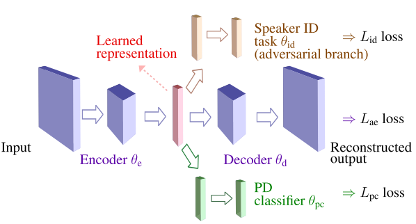

# ***Supervised Speech Representation Learning for Parkinson's Disease Classification***


<p align="center">

</p>

## **Introduction**

This is the code release of our paper ***Supervised Speech Representation Learning for Parkinson's Disease Classification***


If you happen to use the models and code for your work, please cite the following paper

```
@INPROCEEDINGS{Janbakhshi2021ITG,
author={Janbakhshi, Parvaneh and Kodrasi, Ina},
booktitle={ITG Conference on Speech Communication},
Note = {accpted},
title={Supervised Speech Representation Learning for Parkinson’s Disease Classification},
Month = {July},
year={2021},
pages={arXiv:2106.00531}}
```

We include in this repo

* Supervised representation learning for Parkinson’s disease (PD) classification using an auto-encoder and auxiliary tasks (i.e., Adversarial speaker identity-invariant training and PD discriminative training)
    * Speech representation computation (database preprocessing), we included both on-the-fly and offline data preprocessing.
    * Training an upstream task, i.e., an auto-encoder, which can be jointly trained with the auxiliary speaker identification (ID) task and/or with the auxiliary PD classifiers. 
    * Training/testing the final downstream task, e.g., PD classification, using the pre-trained representation (from upstream task).


## **Requirements**
Python 3 or above
PyTorch 1.6.0 or above
Other required packages are listed below, and also in requirements.yml:
- cudatoolkit
- joblib
- pandas
- torchaudio
- yaml
- soundfile
- tqdm


## Dataset
We tested the method on the Spanish PC-GITA database using cross-fold validation paradigm, however here as a demo for feature extraction (both on-the-fly and offline), we used a **dummy database** from wav samples of "Boston University Radio Corpus Data (female speaker)".
`https://catalog.ldc.upenn.edu/LDC96S36`
`http://www.fit.vutbr.cz/~motlicek/speech_hnm.html`
To know more about the used pathological speech database, please refer to our paper.

## **Preprocessing**
For the feature extraction and preprocessing of the data, we provide the default configs file audio_config.yaml under the config/ directory.
To preprocess the data, run preprocess.py in database directory (e.g., dummy_database), which 
i) (optionally) segments speech data for each speaker into short utterances (e.g, 8 seconds), ii) computes and save feature representation data (for offline usage), iii) creates table of train/test/validation folds under folds/ directory required for both on-the-fly (e.g., {train/test/val}_fold{num}_online.csv) and offline (e.g., {train/test/val}_fold{num}_{feature_type}_offline.csv) feature extraction options.
```
python preprocess/dummy_database/preprocess.py
```
## **Upstream training with auxiliary tasks**

For the representation training, we provide default configs under the config/ directory to set the models architecture and set the training and data loading parameters. For setting the main upstream task (AE) upstream_config.yaml, for adversarial speaker ID auxiliary task (auxiliary 1), upstream_auxiliary1_config.yaml, and for PD discrimination auxiliary task (auxiliary 2) upstream_auxiliary1_config.yaml are used. 

Three different upstream (AE) models can be used; by setting "SelectedNetwork: {model}" in upstream_config.yaml; model="AECNNNet" for using CNN auto-encoder (as in our paper), model="AEMLPNet" for using MLP auto-encoder, model="AERNNNet" for using RNN auto-encoder.

To train the upstream model (e.g., for fold 1) with auxiliary tasks with loss weights -0.01 and 0.01 (corresponding to $-\lambda$ and $\alpha$ in our paper, respectively):
```
python train_upstream.py --newinit --valmonitor --auxiltr --auxlossw1 -0.01 --auxlossw2 0.01
```
NOTE: for an *adversarial auxiliary task* (i.e., speaker ID task), the loss weight should be a *negative* number (e.g., -0.01)

in case of using only one auxiliary task for the upstream training, set the corresponding loss weight argument to zero (e.g., "--auxlossw2 0" )

To train the upstream models without any auxiliary tasks:
```
python train_upstream.py --newinit --valmonitor 
```
Results of the experiments are saved in /results/{ups}-{expname} directory.

## **Downstream training/evaluation**

After training the upstream task and obtaining the speech representation model (for each fold), the final downstream model (e.g., PD classification) can be trained. We provide the default config file downstream_config.yaml under the config/ directory to set the models architectures, and set the training and data loading parameters. To train the downstream model using the pre-trained upstream encoder model (e.g., speech representation  model), while freezing the parameters of upstream encoder:

```
python train_downstream.py --valmonitor --newinit --mode train --fold 1
```
in case of fine-tuning the upstream encoder along with downstream training use "--upstream_trainable" argument.

For evaluating the previously saved downstream model, use "--mode evaluation" argument instead of "--mode train".

Results of the experiments are saved in /results/{ds}-{expname} directory.


